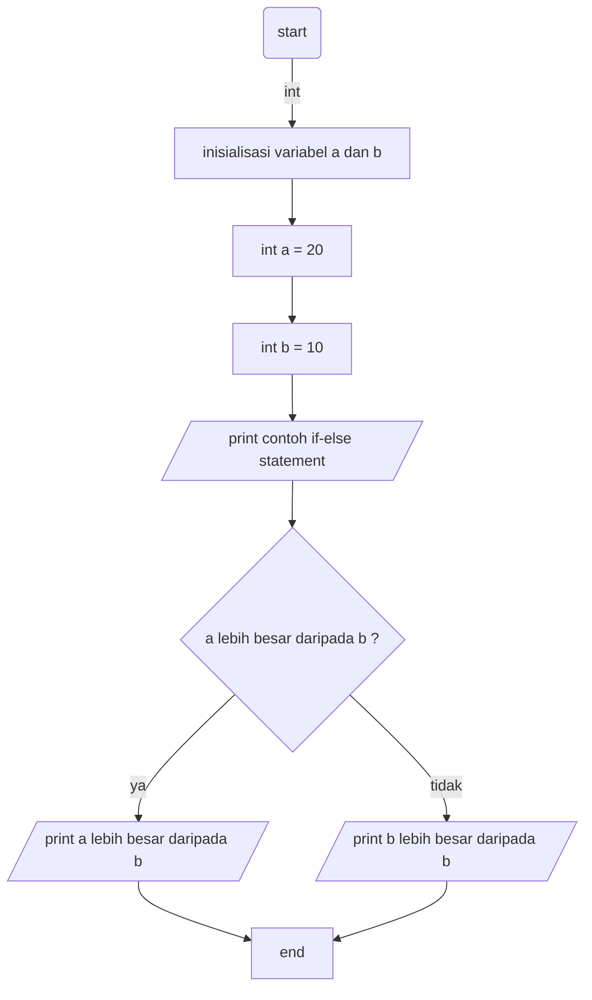

```mermaid
    flowchart TD;
    A(start) --int-->B[inisialisasi variabel a dan b];
    B --> C[int a = 20];
    C --> D[int b = 10];
    D --> E[/print contoh if-else statement/];
    E --> F{a lebih besar daripada b ?};
    F --> |ya| G[/print a lebih besar daripada b/];
    F --> |tidak| H[/print b lebih besar daripada b/];
    G & H --> I[end];
```