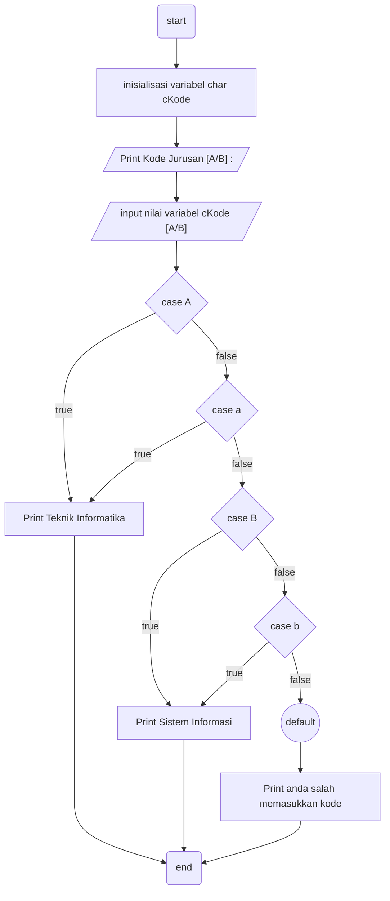

```mermaid
     flowchart TD;
     A(start) --> B[inisialisasi variabel char cKode];
     B --> C[/"Print Kode Jurusan [A/B] : "/];
     C --> D[/"input nilai variabel cKode [A/B]"/];
     D --> E{case A};
     E --true--> F[Print Teknik Informatika];
     E --false--> G{case a};
     G --true--> F;
     G --false--> H{case B};
     H --true--> I[Print Sistem Informasi];
     H --false--> J{case b};
     J --true--> I;
     J --false-->K((default));
     K --> L[Print anda salah memasukkan kode];
     F & I & L --> M(end);
```